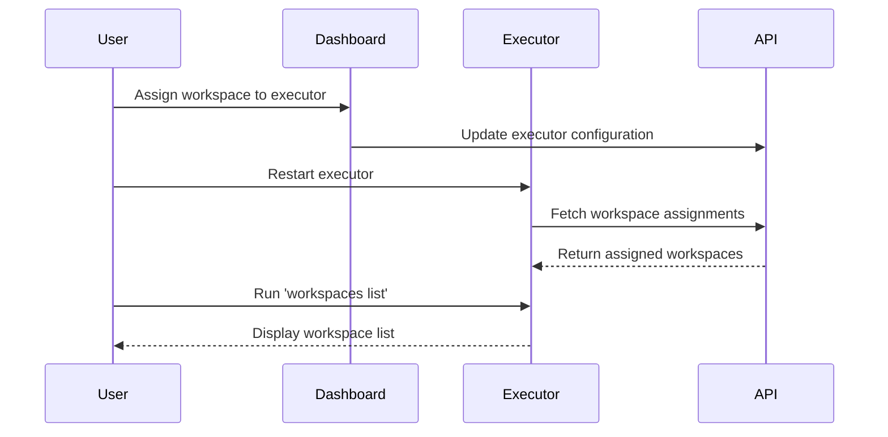

The `workspaces` command provides subcommands to manage workspace assignments for your Flowbaker executor.

## Usage

```bash
flowbaker workspaces [subcommand] [flags]
```

## Description

Workspaces in Flowbaker are isolated environments where you build and run workflows. An executor can be assigned to one or more workspaces, allowing it to execute workflows for those workspaces.

The workspaces command helps you:
- View which workspaces are assigned to your executor
- See detailed information about each workspace
- Verify workspace assignments after configuration changes

## Subcommands

### list

List all workspaces assigned to this executor.

```bash
flowbaker workspaces list
```

## Flags

This command supports all [global flags](/cli/overview#global-flags):

- `--debug` - Enable debug logging
- `--api-url` - Override API URL

## Examples

### List Assigned Workspaces

```bash
flowbaker workspaces list
```

**Output:**

```
📋 Assigned Workspaces:
   1. Production (production)
   2. Staging (staging)

Total: 2 workspace(s)
```

### Single Workspace

```bash
flowbaker workspaces list
```

**Output:**

```
📋 Assigned Workspaces:
   1. My Workspace (my-workspace)

Total: 1 workspace(s)
```

### No Workspaces Assigned

```bash
flowbaker workspaces list
```

**Output:**

```
📋 Assigned Workspaces:
   No workspaces assigned
```

<Note>
If no workspaces are assigned, add workspace assignments in the Flowbaker dashboard, then restart your executor.
</Note>

### With Debug Logging

```bash
flowbaker workspaces list --debug
```

**Output:**

```
DBG Debug logging enabled
DBG Loading configuration from storage
DBG Configuration loaded successfully
DBG Initializing Flowbaker client
DBG Fetching workspace details from API
DBG API request: GET /executor/workspaces
DBG Received 2 workspaces
📋 Assigned Workspaces:
   1. Production (production)
   2. Staging (staging)

Total: 2 workspace(s)
```

### Executor Not Set Up

```bash
flowbaker workspaces list
```

**Output:**

```
❌ Executor is not set up. Run 'start' to begin setup.
```

**Exit code:** 1

## Workspace Information

Each workspace listing shows:

1. **Number** - Sequential number for the list
2. **Name** - Human-readable workspace name
3. **Slug** - URL-safe identifier in parentheses

```
1. Production (production)
   │           │
   │           └─ Slug: Used in API calls and URLs
   └─ Name: Display name shown in dashboard
```

### Workspace Name

The display name of the workspace as shown in the Flowbaker dashboard:

```
Production
Staging Environment
My Test Workspace
```

### Workspace Slug

A URL-safe identifier used in API calls:

```
production
staging-environment
my-test-workspace
```

- Lowercase alphanumeric characters and hyphens
- Unique within your Flowbaker account
- Used for API routing and workflow execution

## Use Cases

### Verify Configuration

After setting up the executor, confirm workspace assignments:

```bash
flowbaker start
# ... setup completes ...
flowbaker workspaces list
```

### Monitor Assignment Changes

After modifying workspace assignments in the dashboard:

```bash
# 1. Update assignments in Flowbaker dashboard
# 2. Restart the executor
sudo systemctl restart flowbaker

# 3. Verify new assignments
flowbaker workspaces list
```

### Troubleshooting Workflow Execution

If workflows aren't executing, verify the workspace is assigned:

```bash
flowbaker workspaces list
```

Check that the workspace you're trying to use appears in the list.

### Multi-Environment Setup

Verify which environments this executor serves:

```bash
flowbaker workspaces list
```

**Output:**

```
📋 Assigned Workspaces:
   1. Production (production)
   2. Staging (staging)
   3. Development (development)

Total: 3 workspace(s)
```

## Managing Workspace Assignments

<Info>
Workspace assignments are managed through the Flowbaker dashboard, not the CLI. The CLI only displays current assignments.
</Info>

### Adding Workspaces

1. Log in to Flowbaker dashboard
2. Navigate to your executor settings
3. Add workspace assignments
4. Restart the executor:

```bash
flowbaker start
```

### Removing Workspaces

1. Remove assignment in Flowbaker dashboard
2. Restart the executor:

```bash
flowbaker start
```

3. Verify removal:

```bash
flowbaker workspaces list
```

## Error Handling

### Not Set Up

```bash
flowbaker workspaces list
```

**Output:**

```
❌ Executor is not set up. Run 'start' to begin setup.
```

**Solution:** Complete executor setup first:

```bash
flowbaker start
```

### Failed to Load Configuration

```bash
flowbaker workspaces list
```

**Output:**

```
FATAL Failed to load configuration error="config file not found"
```

**Solution:** Reset and reconfigure:

```bash
flowbaker reset
flowbaker start
```

### Failed to Fetch Workspace Details

```bash
flowbaker workspaces list
```

**Output:**

```
FATAL Failed to fetch workspace details error="connection refused"
```

**Possible causes:**

- Flowbaker API is unreachable
- Network connectivity issues
- Invalid API URL in configuration
- Executor authentication failed

**Solution:**

```bash
# Check status first
flowbaker status

# Verify API URL is correct
flowbaker status --debug

# Try with custom API URL if needed
flowbaker workspaces list --api-url https://api.flowbaker.com
```

## Workspace Assignment Flow



## Integration Examples

### Bash Script

Check if a specific workspace is assigned:

```bash
#!/bin/bash
WORKSPACE_NAME="Production"

if flowbaker workspaces list | grep -q "$WORKSPACE_NAME"; then
    echo "Workspace $WORKSPACE_NAME is assigned"
    exit 0
else
    echo "Workspace $WORKSPACE_NAME is NOT assigned"
    exit 1
fi
```

### Count Workspaces

```bash
#!/bin/bash
COUNT=$(flowbaker workspaces list | grep -oP 'Total: \K\d+' || echo "0")
echo "Executor has $COUNT workspace(s) assigned"

if [ "$COUNT" -eq 0 ]; then
    echo "Warning: No workspaces assigned!"
    exit 1
fi
```

### CI/CD Health Check

```bash
#!/bin/bash
# Verify executor has required workspaces
REQUIRED=("production" "staging")

OUTPUT=$(flowbaker workspaces list)

for workspace in "${REQUIRED[@]}"; do
    if ! echo "$OUTPUT" | grep -qi "$workspace"; then
        echo "ERROR: Required workspace '$workspace' not assigned"
        exit 1
    fi
done

echo "All required workspaces are assigned"
```

## See Also

- [start](/cli/start) - Start the executor service
- [status](/cli/status) - Check executor status
- [reset](/cli/reset) - Reset configuration
