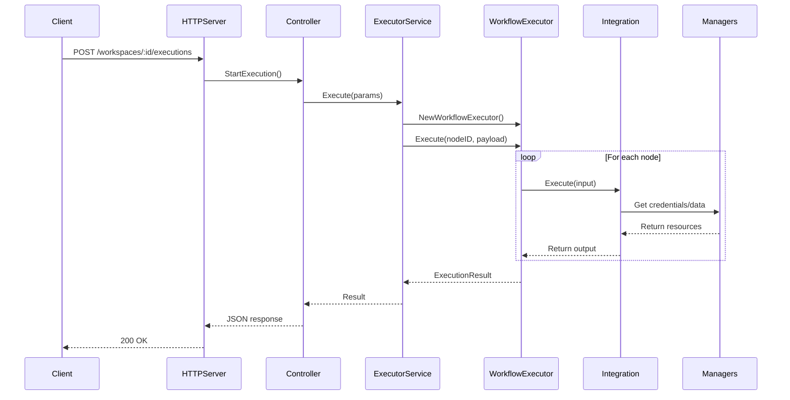

## Overview

Flowbaker is a self-hosted workflow automation executor built in Go with a modular, scalable architecture. The system is designed to execute workflows triggered by various events, orchestrate nodes, and manage integrations with external services.

## Core Components

### Executor Container

The executor container is the main dependency injection container that initializes and wires together all system components.

```go
type ExecutorContainer struct {
    configManager                domain.ConfigManager
    workspaceRegistrationManager domain.WorkspaceRegistrationManager
}
```

Key responsibilities:
- Managing configuration through `ConfigManager`
- Handling workspace registration and assignments
- Building and providing executor dependencies
- Initializing the integration system

Location: `internal/initialization/executor_container.go:30`

### HTTP Server

The HTTP server provides the API interface for workflow execution and management.

```go
type HTTPServerDependencies struct {
    Config             domain.ExecutorConfig
    ExecutorController *controllers.ExecutorController
    KeyProvider        middlewares.WorkspaceAPIKeyProvider
}
```

#### Key Endpoints

| Endpoint | Method | Purpose |
|----------|--------|----------|
| `/health` | GET | Health check (no auth required) |
| `/workspaces` | POST | Register new workspace |
| `/workspaces/:workspaceID/executions` | POST | Start workflow execution |
| `/workspaces/:workspaceID/executions/:executionID` | DELETE | Stop execution |
| `/workspaces/:workspaceID/executions/:executionID/nodes/:nodeID` | POST | Rerun specific node |
| `/workspaces/:workspaceID/polling-events` | POST | Handle polling events |
| `/workspaces/:workspaceID/connection-test` | POST | Test integration connection |
| `/workspaces/:workspaceID/peek-data` | POST | Peek integration data |

Location: `internal/server/server.go:26`

### Executor Controller

The controller handles API-initiated requests and coordinates between the HTTP layer and the executor service.

```go
type ExecutorController struct {
    executorService              executor.WorkflowExecutorService
    workspaceRegistrationManager domain.WorkspaceRegistrationManager
}
```

<Note>
The ExecutorController acts as the bridge between HTTP requests and the workflow execution engine.
</Note>

Location: `internal/controllers/executor_controller.go:17`

### Workflow Executor Service

The service layer manages workflow execution lifecycle, including:
- Creating and managing workflow executors
- Tracking active executions in a registry
- Handling execution cancellation
- Managing polling events and connection tests

```go
type WorkflowExecutorService interface {
    Execute(ctx context.Context, params ExecuteParams) (ExecutionResult, error)
    Stop(ctx context.Context, executionID string) error
    HandlePollingEvent(ctx context.Context, event domain.PollingEvent) (domain.PollResult, error)
    TestConnection(ctx context.Context, params TestConnectionParams) (bool, error)
    PeekData(ctx context.Context, params PeekDataParams) (domain.PeekResult, error)
    RerunNode(ctx context.Context, params RerunNodeParams) (ExecutionResult, error)
    RunNode(ctx context.Context, params RunNodeParams) (RunNodeResult, error)
}
```

Location: `pkg/domain/executor/workflow_executor_service.go:25`

### Managers

Flowbaker uses specialized managers to handle different aspects of the system:

#### ExecutorCredentialManager
Manages credential retrieval and decryption for integrations.

Location: `internal/managers/executor_credential_manager.go`

#### ExecutorIntegrationManager
Handles integration metadata and configuration.

Location: `internal/managers/executor_integration_manager.go`

#### ExecutorStorageManager
Provides access to Flowbaker's storage system for workflow data.

Location: `internal/managers/executor_storage_manager.go`

#### ExecutorScheduleManager
Manages scheduled workflow executions and cron jobs.

Location: `internal/managers/executor_schedule_manager.go`

#### ExecutorKnowledgeManager
Handles knowledge base operations for AI-powered workflows.

Location: `internal/managers/executor_knowledge_manager.go`

#### ExecutorModelManager
Manages AI model configurations and access.

Location: `internal/managers/executor_model_manager.go`

#### ExecutorEventPublisher
Publishes execution events to the Flowbaker API.

Location: `internal/managers/executor_event_publisher.go`

#### ExecutorTaskPublisher
Publishes tasks for async processing.

Location: `internal/managers/executor_task_publisher.go`

## Component Interaction Flow



## Initialization Flow

The executor initialization follows this sequence:

1. **Create Executor Container**
   - Initialize `ConfigManager`
   - Setup `WorkspaceRegistrationManager`

2. **Build Dependencies**
   - Create expression binder (Kangaroo)
   - Initialize integration selector
   - Setup all managers (storage, credentials, events, etc.)
   - Register all integrations

3. **Create Services**
   - Build `WorkflowExecutorService`
   - Create `ExecutorController`

4. **Start HTTP Server**
   - Configure middleware (CORS, logging, authentication)
   - Register routes
   - Start listening

Location: `internal/initialization/executor_container.go:62`

## Integration System

Integrations are registered with the `IntegrationSelector` which manages:

```go
type IntegrationDeps struct {
    FlowbakerClient            flowbaker.ClientInterface
    ExecutorTaskPublisher      ExecutorTaskPublisher
    TaskSchedulerService       TaskSchedulerService
    ParameterBinder            IntegrationParameterBinder
    IntegrationSelector        IntegrationSelector
    ExecutorStorageManager     ExecutorStorageManager
    ExecutorCredentialManager  ExecutorCredentialManager
    ExecutorIntegrationManager ExecutorIntegrationManager
    ExecutorScheduleManager    ExecutorScheduleManager
    ExecutorKnowledgeManager   ExecutorKnowledgeManager
    ExecutorModelManager       ExecutorModelManager
}
```

Each integration can provide:
- **Creator**: Creates integration instances for execution
- **Poller**: Handles polling-based triggers
- **ConnectionTester**: Tests integration credentials
- **HTTPClientProvider**: Provides authenticated HTTP clients

Location: `pkg/domain/integration.go:266`

## Authentication & Security

Flowbaker uses API signature verification for request authentication:

- **Static API Key**: Via `STATIC_API_SIGNATURE_PUBLIC_KEY` environment variable
- **Workspace-aware Keys**: Dynamic keys provided by `WorkspaceAPIKeyProvider`

All workspace-specific endpoints require valid API signatures.

Location: `internal/auth/api_signature.go`

## Execution Registry

Active executions are tracked in an execution registry:

```go
type ExecutionRegistry struct {
    executions map[string]ActiveExecution
    mtx        *sync.RWMutex
}

type ActiveExecution struct {
    ExecutionID string
    WorkflowID  string
    WorkspaceID string
    CancelFunc  context.CancelFunc
}
```

This enables:
- Execution cancellation via stop endpoints
- Concurrent execution management
- Resource cleanup on completion

Location: `pkg/domain/executor/workflow_executor_service.go:46`

## Configuration Management

The `ConfigManager` handles executor configuration:
- X25519 private key for credential decryption
- Workspace registration settings
- Executor identification
- Connection parameters

<Tip>
Configuration is loaded at startup and can be updated dynamically through the workspace registration system.
</Tip>

## Next Steps

<CardGroup cols={2}>
  <Card title="Workflows" icon="diagram-project" href="/concepts/workflows">
    Learn about workflow structure and lifecycle
  </Card>
  <Card title="Nodes" icon="circle-nodes" href="/concepts/nodes">
    Understand workflow nodes and execution
  </Card>
  <Card title="Integrations" icon="plug" href="/concepts/integrations">
    Explore available integrations
  </Card>
  <Card title="Executors" icon="server" href="/concepts/executors">
    Deep dive into executor operations
  </Card>
</CardGroup>