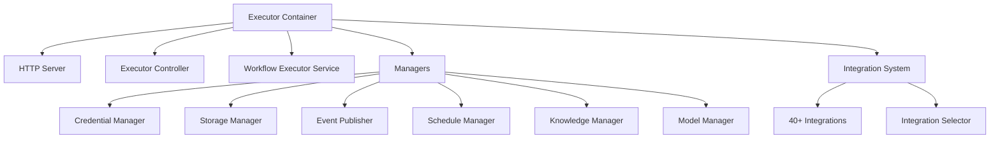

## Overview

Executors are the core runtime components of Flowbaker that execute workflows. Each executor is a self-contained service that can handle multiple workspaces and execute workflows in parallel.

## Executor Architecture

An executor consists of several key components:



## Executor Container

The executor container manages the lifecycle of all components:

```go
type ExecutorContainer struct {
    configManager                domain.ConfigManager
    workspaceRegistrationManager domain.WorkspaceRegistrationManager
}
```

Location: `internal/initialization/executor_container.go:30`

### Container Responsibilities

1. **Configuration Management**: Load and manage executor configuration
2. **Workspace Registration**: Handle workspace assignments
3. **Dependency Injection**: Build and wire all dependencies
4. **Integration Registration**: Initialize all integrations
5. **Service Creation**: Create executor services and controllers

## Executor Initialization

The initialization process follows these steps:

### 1. Create Executor Container

```go
container, err := initialization.NewExecutorContainer()
if err != nil {
    log.Fatal().Err(err).Msg("Failed to create executor container")
}
```

This initializes:
- `ConfigManager` for configuration
- `WorkspaceRegistrationManager` for workspace handling

Location: `internal/initialization/executor_container.go:35`

### 2. Build Executor Dependencies

```go
type ExecutorDependencyConfig struct {
    FlowbakerClient *flowbaker.Client
    ExecutorID      string
    Config          domain.ExecutorConfig
}

deps, err := container.BuildExecutorDependencies(ctx, config)
```

This creates:

#### Expression Binder
```go
kangarooBinder, err := expressions.NewKangarooBinder(
    expressions.KangarooBinderOptions{
        Logger:         logger,
        DefaultTimeout: 5 * time.Second,
    })
```

The Kangaroo binder evaluates expressions in node properties.

#### Integration Selector
```go
integrationSelector := domain.NewIntegrationSelector()
```

Manages all available integrations.

#### Managers

All specialized managers are initialized:

```go
executorStorageManager := managers.NewExecutorStorageManager(...)
executorCredentialManager := managers.NewExecutorCredentialManager(...)
executorEventPublisher := managers.NewExecutorEventPublisher(...)
executorTaskPublisher := managers.NewExecutorTaskPublisher(...)
executorIntegrationManager := managers.NewExecutorIntegrationManager(...)
executorScheduleManager := managers.NewExecutorScheduleManager(...)
executorKnowledgeManager := managers.NewExecutorKnowledgeManager(...)
executorModelManager := managers.NewExecutorModelManager(...)
```

#### Workflow Executor Service

```go
workflowExecutorService := executor.NewWorkflowExecutorService(
    executor.WorkflowExecutorServiceDependencies{
        IntegrationSelector:   integrationSelector,
        OrderedEventPublisher: orderedEventPublisher,
        FlowbakerClient:       config.FlowbakerClient,
        CredentialManager:     executorCredentialManager,
    })
```

#### Executor Controller

```go
executorController := controllers.NewExecutorController(
    controllers.ExecutorControllerDependencies{
        WorkflowExecutorService:      workflowExecutorService,
        WorkspaceRegistrationManager: workspaceRegistrationManager,
    })
```

Location: `internal/initialization/executor_container.go:62`

### 3. Register Integrations

```go
if err := registerIntegrations(integrationSelector, integrationDeps); err != nil {
    return nil, err
}
```

This registers all 40+ integrations with the selector.

Location: `internal/initialization/integrations.go:245`

### 4. Start HTTP Server

```go
server := server.NewHTTPServer(ctx, server.HTTPServerDependencies{
    Config:             config,
    ExecutorController: deps.ExecutorController,
    KeyProvider:        keyProvider,
})

server.Listen(":8080")
```

Location: `internal/server/server.go:26`

## Workspace Management

Executors can be assigned to multiple workspaces:

### Workspace Registration

Workspaces are registered with the executor:

```go
type RegisterWorkspaceParams struct {
    ExecutorID string
    Passcode   string
    Assignment WorkspaceAssignment
}

type WorkspaceAssignment struct {
    WorkspaceID   string
    WorkspaceName string
    WorkspaceSlug string
    APIPublicKey  string
}
```

**Registration Flow**:

1. API sends registration request to executor
2. Executor validates passcode
3. Workspace is stored in configuration
4. API public key is saved for request verification
5. Executor can now process workflows for this workspace

Location: `pkg/domain/workspace_registration_manager.go`

### Workspace Unregistration

```go
func (c *ExecutorController) UnregisterWorkspace(ctx fiber.Ctx) error {
    workspaceID := ctx.Params("workspaceID")
    
    err := c.workspaceRegistrationManager.UnregisterWorkspace(ctx.RequestCtx(), workspaceID)
    if err != nil {
        return fiber.NewError(fiber.StatusInternalServerError, "Failed to unregister workspace")
    }
    
    return ctx.JSON(executortypes.UnregisterWorkspaceResponse{
        Success: true,
    })
}
```

Location: `internal/controllers/executor_controller.go:308`

## Executor Configuration

```go
type ExecutorConfig struct {
    EnableWorkspaceRegistration bool
    X25519PrivateKey            string
}
```

### Configuration Properties

**EnableWorkspaceRegistration**
- When `true`: Executor accepts workspace registration requests
- When `false`: Only pre-configured workspaces can use executor
- Used for security in production environments

**X25519PrivateKey**
- Used to decrypt credentials from the API
- Generated during executor setup
- Must be kept secret
- Corresponding public key is registered with API

<Warning>
The X25519 private key must be kept secure. If compromised, all credentials for workspaces on this executor could be exposed.
</Warning>

## Authentication

Executors use API signature verification:

### Static API Key

For single-workspace executors:

```bash
export STATIC_API_SIGNATURE_PUBLIC_KEY="your-public-key"
```

All requests are verified against this key.

### Workspace-Aware Keys

For multi-workspace executors:

```go
type WorkspaceAPIKeyProvider interface {
    GetPublicKey(workspaceID string) (string, error)
}
```

Each workspace has its own API public key stored during registration.

Location: `internal/middlewares/api_signature_middleware.go`

## Execution Registry

Active executions are tracked:

```go
type ExecutionRegistry struct {
    executions map[string]ActiveExecution
    mtx        *sync.RWMutex
}

type ActiveExecution struct {
    ExecutionID string
    WorkflowID  string
    WorkspaceID string
    CancelFunc  context.CancelFunc
}
```

### Registry Operations

**Register Execution**
```go
func (r *ExecutionRegistry) RegisterExecution(activeExecution ActiveExecution)
```

Called when workflow execution starts.

**Unregister Execution**
```go
func (r *ExecutionRegistry) UnregisterExecution(executionID string)
```

Called when workflow execution completes.

**Get Execution**
```go
func (r *ExecutionRegistry) GetExecution(executionID string) (ActiveExecution, bool)
```

Used to retrieve active execution for cancellation.

Location: `pkg/domain/executor/workflow_executor_service.go:46`

## Workflow Execution Service

The service manages workflow execution:

```go
type WorkflowExecutorService interface {
    Execute(ctx context.Context, params ExecuteParams) (ExecutionResult, error)
    Stop(ctx context.Context, executionID string) error
    HandlePollingEvent(ctx context.Context, event domain.PollingEvent) (domain.PollResult, error)
    TestConnection(ctx context.Context, params TestConnectionParams) (bool, error)
    PeekData(ctx context.Context, params PeekDataParams) (domain.PeekResult, error)
    RerunNode(ctx context.Context, params RerunNodeParams) (ExecutionResult, error)
    RunNode(ctx context.Context, params RunNodeParams) (RunNodeResult, error)
}
```

Location: `pkg/domain/executor/workflow_executor_service.go:25`

### Execute Workflow

```go
type ExecuteParams struct {
    ExecutionID       string
    UserID            *string // Optional, for testing workflows
    Workflow          domain.Workflow
    EventName         string
    PayloadJSON       string
    EnableEvents      bool
    IsTestingWorkflow bool
}
```

**Process**:

1. Create workflow executor
2. Convert payload to array format
3. Create cancellable context
4. Register execution in registry
5. Execute workflow
6. Unregister execution
7. Return results

Location: `pkg/domain/executor/workflow_executor_service.go:108`

### Stop Execution

```go
func (s *workflowExecutorService) Stop(ctx context.Context, executionID string) error {
    execution, ok := s.executionRegistry.GetExecution(executionID)
    if !ok {
        return errors.New("execution not found")
    }
    
    // Publish completion event
    err := s.orderedEventPublisher.PublishEvent(eventCtx, 
        &domain.WorkflowExecutionCompletedEvent{...})
    
    // Cancel execution context
    execution.CancelFunc()
    
    return nil
}
```

Location: `pkg/domain/executor/workflow_executor_service.go:166`

### Handle Polling Event

For polling-based triggers:

```go
func (s *workflowExecutorService) HandlePollingEvent(
    ctx context.Context, 
    event domain.PollingEvent,
) (domain.PollResult, error) {
    integrationPoller, err := s.integrationSelector.SelectPoller(ctx, 
        domain.SelectIntegrationParams{
            IntegrationType: event.IntegrationType,
        })
    
    result, err := integrationPoller.HandlePollingEvent(ctx, event)
    
    return result, nil
}
```

Location: `pkg/domain/executor/workflow_executor_service.go:195`

### Test Connection

```go
func (s *workflowExecutorService) TestConnection(
    ctx context.Context, 
    params TestConnectionParams,
) (bool, error) {
    // Get credential
    credential, err := s.credentialManager.GetFullCredential(ctx, params.CredentialID)
    
    // Merge additional payload
    if len(params.Payload) > 0 {
        for key, value := range params.Payload {
            credential.DecryptedPayload[key] = value
        }
    }
    
    // Select connection tester
    connectionTester, err := s.integrationSelector.SelectConnectionTester(ctx, 
        domain.SelectIntegrationParams{
            IntegrationType: params.IntegrationType,
        })
    
    // Test connection
    success, err := connectionTester.TestConnection(ctx, domain.TestConnectionParams{
        Credential: credential,
    })
    
    return success, nil
}
```

Location: `pkg/domain/executor/workflow_executor_service.go:228`

## Credential Management

Executors decrypt and manage credentials:

### Credential Decryption

```go
type ExecutorCredentialDecryptionService interface {
    Decrypt(encrypted []byte) ([]byte, error)
}
```

Credentials are encrypted by the API using the executor's X25519 public key and decrypted by the executor using its private key.

Location: `internal/managers/executor_credential_decryption_service.go`

### Credential Manager

```go
type ExecutorCredentialManager interface {
    GetFullCredential(ctx context.Context, credentialID string) (Credential, error)
}
```

**Process**:

1. Fetch encrypted credential from API
2. Decrypt credential payload
3. Return decrypted credential to integration

Location: `internal/managers/executor_credential_manager.go`

## Event Publishing

Executors publish events to the API:

```go
type ExecutorEventPublisher interface {
    PublishEvent(ctx context.Context, event Event) error
}
```

### Event Types

- **WorkflowExecutionStartedEvent**: Workflow began
- **NodeExecutionStartedEvent**: Node execution started
- **NodeExecutionCompletedEvent**: Node execution finished
- **NodeExecutionFailedEvent**: Node execution failed
- **WorkflowExecutionCompletedEvent**: Workflow completed

### Ordered Event Publishing

```go
type OrderedEventPublisher struct {
    publisher domain.EventPublisher
}
```

Ensures events are published in the correct order using event order from context.

Location: `pkg/domain/event.go`

## Storage Access

```go
type ExecutorStorageManager interface {
    Get(ctx context.Context, params GetStorageParams) ([]byte, error)
    Set(ctx context.Context, params SetStorageParams) error
    Delete(ctx context.Context, params DeleteStorageParams) error
}
```

Provides workflows with persistent storage.

Location: `internal/managers/executor_storage_manager.go`

## Schedule Management

```go
type ExecutorScheduleManager interface {
    CreateSchedule(ctx context.Context, params CreateScheduleParams) error
    UpdateSchedule(ctx context.Context, params UpdateScheduleParams) error
    DeleteSchedule(ctx context.Context, scheduleID string) error
}
```

Manages cron schedules and periodic workflow triggers.

Location: `internal/managers/executor_schedule_manager.go`

## Knowledge Management

```go
type ExecutorKnowledgeManager interface {
    QueryKnowledge(ctx context.Context, params QueryKnowledgeParams) (QueryResult, error)
    AddKnowledge(ctx context.Context, params AddKnowledgeParams) error
}
```

Provides access to knowledge bases for AI-powered workflows.

Location: `internal/managers/executor_knowledge_manager.go`

## Model Management

```go
type ExecutorModelManager interface {
    GetModel(ctx context.Context, modelID string) (Model, error)
    ListModels(ctx context.Context, workspaceID string) ([]Model, error)
}
```

Manages AI model configurations.

Location: `internal/managers/executor_model_manager.go`

## Execution Observers

Observers track execution progress:

```go
type executionObserver struct {
    handlers       []ExecutionEventHandler
    streamHandlers []StreamEventHandler
    mutex          sync.RWMutex
}
```

### Observer Pattern

**Handlers**:
- `HistoryRecorder`: Records execution history
- `UsageCollector`: Tracks resource usage
- `EventBroadcaster`: Publishes events to API
- `StreamEventBroadcaster`: Streams events in real-time

**Usage**:
```go
observer.Subscribe(historyRecorder)
observer.Subscribe(usageCollector)
observer.Subscribe(eventBroadcaster)
observer.SubscribeStream(streamBroadcaster)
```

Location: `pkg/domain/executor/execution_observer.go`

## Health Monitoring

Executors provide health endpoint:

```bash
curl http://localhost:8080/health
```

**Response**:
```json
{
  "status": "healthy",
  "service": "flowbaker-executor",
  "version": "v1.0.0",
  "timestamp": "2026-03-04T10:00:00Z"
}
```

Location: `internal/server/server.go:36`

## Best Practices

<Check>
**Do's**
- Keep X25519 private key secure
- Enable workspace registration only when needed
- Monitor executor health regularly
- Set appropriate execution timeouts
- Use separate executors for production/testing
</Check>

<Warning>
**Don'ts**
- Don't expose executor ports publicly without authentication
- Don't share private keys between executors
- Don't ignore execution failures
- Don't run executors with excessive permissions
</Warning>

## Deployment Considerations

### Single Executor
- Simpler to manage
- Single point of failure
- Limited scalability
- Good for small deployments

### Multiple Executors
- High availability
- Horizontal scaling
- Workspace isolation
- Load distribution
- More complex management

### Resource Requirements

- **CPU**: Scales with concurrent executions
- **Memory**: Depends on workflow complexity
- **Network**: For API communication and integrations
- **Storage**: For temporary execution data

## Next Steps

<CardGroup cols={2}>
  <Card title="Architecture" icon="diagram-project" href="/concepts/architecture">
    Understand overall system architecture
  </Card>
  <Card title="Workflows" icon="sitemap" href="/concepts/workflows">
    Learn about workflow structure
  </Card>
</CardGroup>