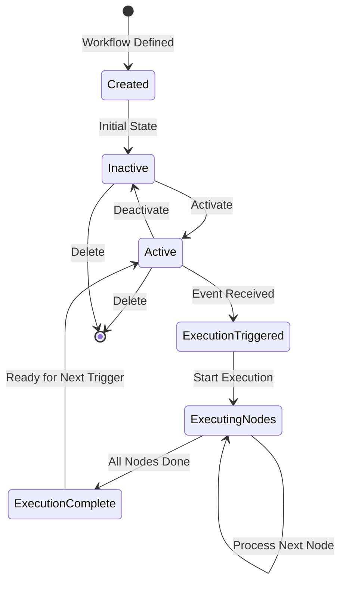

## Overview

A workflow in Flowbaker represents an automated process composed of connected nodes that execute in sequence or parallel based on data flow and event triggers.

## Workflow Type Definition

The core workflow structure is defined in the domain:

```go
type Workflow struct {
    ID               string
    Name             string
    Description      string
    Slug             string
    WorkspaceID      string
    AuthorUserID     string
    Nodes            []WorkflowNode
    Settings         WorkflowSettings
    LastUpdatedAt    time.Time
    ActivationStatus WorkflowActivationStatus
    DeletedAt        *time.Time
}
```

Location: `pkg/domain/workflow.go:26`

### Workflow Properties

| Property | Type | Description |
|----------|------|-------------|
| `ID` | string | Unique workflow identifier |
| `Name` | string | Human-readable workflow name |
| `Description` | string | Workflow purpose and description |
| `Slug` | string | URL-friendly identifier |
| `WorkspaceID` | string | Parent workspace identifier |
| `AuthorUserID` | string | User who created the workflow |
| `Nodes` | []WorkflowNode | Array of workflow nodes |
| `Settings` | WorkflowSettings | Workflow configuration |
| `LastUpdatedAt` | time.Time | Last modification timestamp |
| `ActivationStatus` | WorkflowActivationStatus | Current activation state |
| `DeletedAt` | *time.Time | Soft deletion timestamp (if deleted) |

## Workflow Types

Flowbaker supports two workflow types:

```go
type WorkflowType string

const (
    WorkflowTypeDefault WorkflowType = "default"
    WorkflowTypeTesting WorkflowType = "testing"
)
```

- **Default**: Production workflows that execute normally
- **Testing**: Development workflows for testing and validation

Location: `pkg/domain/workflow.go:8`

## Activation Status

Workflows can be in one of two activation states:

```go
type WorkflowActivationStatus string

const (
    WorkflowActivationStatusActive   WorkflowActivationStatus = "active"
    WorkflowActivationStatusInactive WorkflowActivationStatus = "inactive"
)
```

### Checking Activation Status

```go
func (w Workflow) IsActive() bool {
    return w.ActivationStatus == WorkflowActivationStatusActive
}
```

<Warning>
Only active workflows will process incoming triggers. Inactive workflows ignore all events.
</Warning>

Location: `pkg/domain/workflow.go:19`

## Workflow Settings

Workflow settings control execution behavior:

```go
type WorkflowSettings struct {
    NodeExecutionLimit int
}
```

### Node Execution Limit

The `NodeExecutionLimit` prevents infinite loops by limiting how many times a single node can execute within one workflow run.

- **Default**: 1000 executions per node
- **Override**: Can be overridden per-node via `NodeSettings.OverwriteExecutionLimit`
- **Purpose**: Prevents runaway executions and resource exhaustion

```go
func (w *WorkflowExecutor) getNodeExecutionLimit(node domain.WorkflowNode) int {
    if node.Settings.OverwriteExecutionLimit && node.Settings.ExecutionLimit > 0 {
        return node.Settings.ExecutionLimit
    }
    
    if w.workflow.Settings.NodeExecutionLimit > 0 {
        return w.workflow.Settings.NodeExecutionLimit
    }
    
    return DefaultNodeExecutionLimit // 1000
}
```

Location: `pkg/domain/workflow.go:40`, `pkg/domain/executor/workflow_executor.go:801`

## Workflow Methods

The Workflow type provides utility methods for node traversal:

### GetNodeByID

Retrieve a specific node by its ID:

```go
func (w Workflow) GetNodeByID(nodeID string) (WorkflowNode, bool)
```

**Example**:
```go
node, exists := workflow.GetNodeByID("node-123")
if !exists {
    return fmt.Errorf("node not found")
}
```

Location: `pkg/domain/workflow.go:48`

### GetTriggerNodes

Retrieve all trigger nodes in the workflow:

```go
func (w Workflow) GetTriggerNodes() []WorkflowNode
```

Trigger nodes initiate workflow execution when events occur.

Location: `pkg/domain/workflow.go:57`

### GetActionNodes

Retrieve all action nodes in the workflow:

```go
func (w Workflow) GetActionNodes() []WorkflowNode
```

Action nodes perform operations and transformations.

Location: `pkg/domain/workflow.go:81`

### GetSubNodes

Retrieve child nodes of a specific parent:

```go
func (w Workflow) GetSubNodes(nodeID string) []WorkflowNode
```

Useful for hierarchical node structures and conditional branches.

Location: `pkg/domain/workflow.go:69`

## Workflow Execution Lifecycle



### 1. Workflow Creation

- Workflow is defined with nodes and connections
- Initial state is **inactive**
- No executions will trigger until activated

### 2. Activation

- User activates the workflow
- Trigger nodes begin listening for events
- Workflow is ready to execute

### 3. Trigger Event

- External event matches a trigger node
- Execution ID is generated
- Workflow executor is instantiated

### 4. Node Execution

- Trigger node executes first
- Output propagates to connected nodes
- Nodes execute based on input availability
- Execution continues until no more nodes to process

### 5. Completion

- All nodes complete or fail
- Execution results are recorded
- Events are published
- Workflow returns to active state

## Workflow Execution Process

When a workflow executes:

1. **Initialization**
   - Create `WorkflowExecutor` instance
   - Setup execution context
   - Initialize observers and recorders

2. **Queue Trigger Node**
   - Add trigger node to execution queue
   - Set initial payload from trigger event

3. **Process Execution Queue**
   - Pop node from queue (LIFO - Last In First Out)
   - Check execution limit
   - Execute node
   - Collect output
   - Propagate to downstream nodes
   - Add downstream nodes to queue

4. **Handle Waiting Tasks**
   - Nodes with multiple inputs wait for all inputs
   - Track received payloads per input
   - Execute when all required inputs received

5. **Complete Execution**
   - Collect execution history
   - Record usage statistics
   - Publish completion event
   - Return results

Location: `pkg/domain/executor/workflow_executor.go:187`

## Execution Context

Each workflow execution has an associated context:

```go
type WorkflowExecutionContext struct {
    UserID              *string
    InputPayload        domain.Payload
    WorkspaceID         string
    WorkflowID          string
    WorkflowExecutionID string
    EnableEvents        bool
    Observer            *executionObserver
    IsFromErrorTrigger  bool
    IsTesting           bool
    TriggerNode         domain.WorkflowNode
}
```

The context provides:
- User identification for permissions
- Original trigger payload
- Execution tracking IDs
- Event publishing configuration
- Execution observation hooks
- Error handling context

Location: `pkg/domain/execution_context.go`

## Execution Results

Workflow execution returns detailed results:

```go
type ExecutionResult struct {
    Payload              []byte
    Headers              map[string][]string
    StatusCode           int
    NodeExecutionResults []domain.NodeExecutionEntry
}
```

- **Payload**: Response data (for webhook workflows)
- **Headers**: HTTP headers (for webhook workflows)
- **StatusCode**: HTTP status code (for webhook workflows)
- **NodeExecutionResults**: Execution history for all nodes

Location: `pkg/domain/executor/workflow_executor_service.go:17`

## Node Execution History

Each node execution is recorded:

```go
type NodeExecutionEntry struct {
    NodeID          string
    ItemsByInputID  map[string]NodeItems
    ItemsByOutputID map[string]NodeItems
    EventType       EventType
    Error           string
    Timestamp       int64
    ExecutionOrder  int
}
```

This provides:
- Complete audit trail
- Debugging information
- Rerun capability
- Performance analysis

Location: `pkg/domain/execution.go:10`

## Error Handling

Workflows support error handling through:

### 1. Error Triggers

Special trigger nodes that activate on errors:

```go
func (w *WorkflowExecutor) IsErrorTrigger(nodeID string) bool {
    node, exists := w.workflow.GetNodeByID(nodeID)
    if !exists {
        return false
    }
    
    return node.Type == domain.NodeTypeTrigger && 
           node.TriggerNodeOpts.EventType == "on_error"
}
```

Location: `pkg/domain/executor/workflow_executor.go:792`

### 2. Return Error as Item

Nodes can convert errors to items for continued processing:

```go
type NodeSettings struct {
    ReturnErrorAsItem       bool
    OverwriteExecutionLimit bool
    ExecutionLimit          int
}
```

When `ReturnErrorAsItem` is true:
- Errors don't halt execution
- Error is wrapped as an item
- Downstream nodes receive error item
- Workflow continues processing

Location: `pkg/domain/workflow.go:143`

## Best Practices

<Check>
**Do's**
- Set reasonable execution limits
- Use activation status to control production vs testing
- Implement error handling nodes for critical workflows
- Monitor execution history for bottlenecks
</Check>

<Warning>
**Don'ts**
- Don't create circular dependencies without execution limits
- Don't leave test workflows active in production
- Don't ignore execution failure patterns
- Don't set execution limits too low for legitimate loops
</Warning>

## Next Steps

<CardGroup cols={2}>
  <Card title="Nodes" icon="circle-nodes" href="/concepts/nodes">
    Learn about workflow nodes and types
  </Card>
  <Card title="Integrations" icon="plug" href="/concepts/integrations">
    Explore available integrations for nodes
  </Card>
</CardGroup>